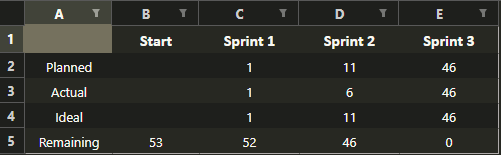

# Project 3 Final Project - The Coolest Team

original repo can be found here
https://github.com/msu-denver/project-3-final-project-the-coolest-team/tree/dev

## Table of Contents

- [Introduction](#introduction)
- [Installation and Deployment](#installation-and-deployment)
  - [1. Clone the Repository](#1-clone-the-repository)
  - [2. Set Up Environment Variables](#2-set-up-environment-variables)
  - [3. Build and Run Docker Containers](#3-build-and-run-docker-containers)
  - [4. Access the Application](#4-apply-database-migrations)
- [Creating and Applying New Migrations](#creating-and-applying-new-migrations)
- [Troubleshooting](*troubleshooting)
- [Usage](#usage)
- [API Endpoints](#api-endpoints)
- [Features](#features)
- [Project Structure](#project-structure)
- [Classes](#classes)
- [Model](#model)
- [User Stories](#user-stories)
- [STEPS TO RESTORE DATABASE USING DUMP FILE](#dump-file)

## Introduction

**The Coolest Team** is a web application designed to provide users with a simple and easy-to-use platform for managing and exploring movies and TV shows. Our application allows users to register, search for media, create personalized favorites lists, write reviews, and receive tailored recommendations based on their preferences. Administrators have enhanced control to manage user accounts and oversee content, including deleting user reviews and toggling the admin status of existing users. 

This application was tested using the full IMDB dataset, including over 1m+ unique entries for both Movies and TV shows. To make it easier to use, the production version here is provided with a smaller dataset of the top 1000 top movies and TV shows.

## Prerequisites

- [Docker](https://www.docker.com/get-started) installed on your machine
- [Docker Compose](https://docs.docker.com/compose/install/) installed
- Git installed

## Installation and Deployment

1. **Clone the Repository**

    ```bash
    git clone https://github.com/yourusername/your-repo-name.git
    cd your-repo-name
    ```

2. **Set Up Environment Variables**

    The `.env` file contains all necessary configurations for both Flask and PostgreSQL. Since the `.env` file is uploaded to the repository, you can directly use it without copying.

    **`.env`**

    ```env
    # Flask Configuration
    FLASK_APP=run
    FLASK_ENV=development
    FLASK_RUN_HOST=0.0.0.0
    FLASK_RUN_PORT=5000
    FLASK_DEBUG=1 # Set to 0 for production, 1 for development
    OMDB_API_KEY=f3dc5913  # Current limit 250k a day

    # Database Configuration
    POSTGRES_USER=coolteam
    POSTGRES_PASSWORD=54153
    POSTGRES_DB=cool_movie_list
    DATABASE_URL=postgresql://coolteam:54153@db:5432/cool_movie_list

    # Security
    SECRET_KEY=movies_are_cool

    # Python Path
    PYTHONPATH=/src/app    
    ```

3. **Build and Run Docker Containers**

    Use Docker Compose to build and start the containers in detached mode. The `entrypoint.sh` script will automatically apply database migrations and populate the database with initial data.

    ```bash
    docker compose up -d --build
    ```
    **Explanation:**
    - `up`: Creates and starts the containers.
    - `-d`: Runs containers in detached mode (in the background).
    - `--build`: Rebuilds the Docker images to incorporate the latest changes.

***WARNING***
If you are running this in a Windows environment, you may get an error when importing the data in the webs container log. 
To circumvent this, disable git's automatic conversion via

```bash
git config --global core.autocrlf input
```
Then reset the repo using this

```bash
git rm --cached -r .
git reset --hard
```

4. **Access the Application**

    Once the Docker containers are up and running, access the Flask application by navigating to [http://localhost:5000/](http://localhost:5000/) in your web browser.

    ```bash
    docker-compose logs -f web
    ```

    **Explanation:**
    - **Monitoring Logs:** The `logs` command allows you to monitor the real-time output of the `web` container. Ensure that there are no errors related to migrations or data import.
    - **What Happens Automatically:**
        - **Database Migrations:** The `entrypoint.sh` script applies any pending database migrations automatically.
        - **Data Import:** The script also imports data from `src/data/top_media.csv` if it hasn't been imported yet.

---

## Creating and Applying New Migrations

Although initial migrations and data import are automated, you'll need to handle migrations manually when you make changes to your database models during development.

1. **Create a New Migration Script**

    After modifying your models, generate a new migration script.

    ```bash
    docker compose exec web flask db migrate -m "Describe your migration here"
    ```

    **Explanation:**
    - `flask db migrate`: Scans your models and generates a new migration script based on the changes.
    - `-m "..."`: Adds a descriptive message to the migration script for clarity.

2. **Apply the Migration to the Database**

    Once the migration script is generated, apply it to update the database schema.

    ```bash
    docker compose exec web flask db upgrade
    ```

    **Explanation:**
    - `flask db upgrade`: Applies the new migration script to the database, updating the schema accordingly.

---

## Troubleshooting

- **Migrations Error:** Ensure the `migrations/` directory is present and contains migration scripts.
- **Import Data Error:** Verify the path to `import_data.py` and `top_media.csv` in `entrypoint.sh`.
- **Verifying Environment Variables:**
  
  To ensure that all environment variables are correctly loaded inside the `web` container, you can run:

  ```bash
    docker compose exec web env | grep FLASK
  ```

### Usage

- **Login:** [http://localhost:5000/login](http://localhost:5000/login)
- **Sign Up:** [http://localhost:5000/signup](http://localhost:5000/signup)
- **Profile:** Accessible via the username in the navbar after logging in.

## API Endpoints

The application provides several API endpoints to facilitate user interaction and data management. Below is a list of available endpoints:

User Authentication

- POST /api/auth/signup - Register a new user.
- POST /api/auth/login - Authenticate an existing user and obtain a token.
- POST /api/auth/logout - Log out the current user.

**Movies/TV Shows Management**

- GET /api/media/search - Search for movies or TV shows based on query parameters.
- GET /api/media/<id> - Retrieve detailed information about a specific movie or TV show.

**Favorites Management**

- POST /api/favorites - Add a movie or TV show to the user's favorites list.
- DELETE /api/favorites/<id> - Remove a movie or TV show from the user's favorites list.
- GET /api/favorites - Retrieve the user's favorites list.

**Reviews Management**

- POST /api/reviews - Add a review for a movie or TV show.
- DELETE /api/reviews/<id> - Delete a user's review (admin only).
- GET /api/reviews/<media_id> - Retrieve all reviews for a specific movie or TV show.

**Recommendations**

- GET /api/recommendations - Get personalized movie or TV show recommendations based on the user's favorites list.

**Admin Endpoints**

GET /api/admin/users - Retrieve all active user accounts.
PUT /api/admin/users/<id>/toggle-admin - Toggle a user's administrator status.
DELETE /api/admin/users/<id> - Delete a user account.

## Features

**User Authentication**

- Secure user registration, login, and logout functionalities.
- Password hashing for enhanced security.
**Favorites Management**
- Users can add or remove movies and TV shows to their personalized favorites list.
- Favorites are accessible via the profile page.
**Search Functionality**
- Advanced search capabilities allowing users to search movies and TV shows by title, genre, rating, and release date.
**Detailed Media Pages**
- Detailed pages for each movie or TV show, displaying images, titles, release information, and average ratings.
**User Reviews**
- Users can add ratings and reviews to movies and TV shows.
- Administrators can delete inappropriate reviews.
**Recommendations**
- Personalized recommendations based on users' favorites lists.
- Options to filter recommendations by rating preferences.
**Administrator Controls**
- Full management of user accounts, including toggling administrator roles and deleting accounts.
- Oversight of user-generated content such as reviews.
**Database Integration**
- Persistent data storage using PostgreSQL.
- Efficient data management with SQLAlchemy and Alembic for migrations.
**Containerized Deployment**
- Seamless deployment using Docker and Docker Compose.
- Easy setup and scalability with containerization.

## Project Structure

project-root/ ├── Dockerfile ├── docker-compose.yml ├── requirements.txt ├── .dockerignore ├── .gitignore ├── README.md └── src/ ├── run.py └── app/ ├── init.py ├── config.py ├── forms.py ├── models.py ├── routes.py └── templates/ ├── home.html ├── login.html └── signup.html

## Classes


## Model 


## User Stories

## US #1 - User Registration and Authentication
- As a user, I want to create an account with a secure password so that I can access the web-app's features. When I fill in the required account information (username, password) I want to hit a 'Submit' button which confirms that my account has been created.

POINTS: 1/2

## US #2 - Login and Logout
- As a user, I want to login and log out securely. On the landing page, I want to be able to hit the 'Log In' button where the system will autheticate my information and upon success, direct me to the main page of the website. When I hit the 'Log Out' button, I want the system to log my account, returning me to the landing page. 

POINTS: 1/2

## US #3 - User Account Control
- As a user, I want to be able to click an "Account" link to be directed to a page that dsplays my account information. I want to be able to edit my password and account picture on this page.

POINTS: 2

## US #4 - Administrator Account Control
- As an administrator, I want to be able to click a button that takes me to a page that displays all active user accounts for the website. I want to be able to toggle users to also be adminstrators. I want to be able to delete user accounts on this page as well, with a confirmation window popping up to confirm before deletion. 

POINTS: 1

## US #5 - Search Movies/TV
- As a user, I want to be able to search either movies or TV shows by title, genres, rating, and release date. When I click the search button after specifying search parameters, I wish to view a list of my filtered results (see US#6)

POINTS: 3

## US #6 - List Filtered Movies/TV
- After a successful search, I want to be able to view a list of movies or tv shows based on those search parameters. 

POINTS: 5

## US #7 - Movie/TV Object Page
- As a user, after a successful search and viewing the list of search results, I want to click a tv/movie and be directed to a page that shows more info on that object. This page would show information such as a key image, title, release information, and average rating.  

POINTS: 8

## US #8 - User Favorites List
- As a user, I want to be able to click a button within the Movie/TV Object Page that will either add or remove that movie/tv object to a favorites list. When I click the "Favorites" button in the menu bar, I want to be directed to a page that shows me my favorites list. 

POINTS: 8

## US #9 - Movie/TV User Review
- As a user, when I'm viewing a page for a Movie/TV Show, I want to be able to fill a field that allows me to add a 1-5 star rating and a short review for that movie. When this review is added, it displays it in a running column within the page for that Movie/TV show. 

- As an administrator, I want to bee able to delete user reviews from their respective page, by clicking an 'X' next to each review that is only visible to administrators. 

POINTS: 10

## US #10 - Movie/TV Recommendation Page
- As a user, I want to click a "Recommendations" button that directs me to a page that will recommend me Movies/TV shows based on my favorites list. I want to be able to specify if I want these recommendations to be either high or lower rated. 

POINTS: 15

## Sequence Diagram

US #8 Sequence - User Favorites List


# Development Process 

For this project, SCRUM methodology was utilized over a period of 3 sprints. Communication was held primarily through a shared Discord channel accessible by the whole team. Except on days where daily scrums could be held during/after class, these were facilitated through the channel by a Discord bot that chimed at 7PM to call all available team members to report any progress or blockages, ask for help, etc. Sprint planning was mostly held in person, but the retrospective and reviews were done remotely also through the shared channel. 

Sprint1
- US1 - User Registration/Authentication -    POINTS: 1/2
- US2 - Login/Logout                          POINTS: 1/2

Sprint2
- US3 - User Account Control                  POINTS: 2
- US4 - Admin Account Control                 POINTS: 1
- US5 - Search Movies/TV                      POINTS: 3
- US6 - List Filtered Search - Movies/TV      POINTS: 5 

Sprint3
- US6 - List Filtered Search - Movies/TV      POINTS: 5
- US7 - Movie/TV Object Page                  POINTS: 8
- US8 - User Favorites List                   POINTS: 8
- US9 - Movie/TV User Review                  POINTS: 10
- US10 - Movie/TV Recommendation Page         POINTS: 15

Burndown Chart



# Testing 
!!!!

# ## Dump File (OPTIONAL)

- WARNING: Database models may not be configured for full IMDB dataset.
- If you wish to test the app with the full dataset, see below.
- Dump file exists in src/app/static/cool_movie_list.dump containing the entire IMDB dataset (1m+ entries)
- The dump file is a snapshot of the populated database. Use this instead of importing the data from the CSV file manually.
- It is located in the `src/static` folder.

- Ensure Docker containers are running via:

    ```bash
    docker-compose up -d
    ```

- In Bash/WSL:

    - Copy the dump file to the `db` container:

    ```bash
    docker cp src/static/cool_movie_list.dump $(docker-compose ps -q db):/tmp/cool_movie_list.dump
    ```

    - Restore the database using `pg_restore`:

    ```bash
    docker-compose exec db pg_restore -U coolteam -d cool_movie_list -v /tmp/cool_movie_list.dump
    ```

- In PowerShell:

    - Retrieve the database container ID:

    ```powershell
    $containerId = docker-compose ps -q db
    ```

    - Copy the dump file to the `db` container:

    ```powershell
    docker cp src/static/cool_movie_list.dump "${containerId}:/tmp/cool_movie_list.dump"
    ```

    - Restore the database using `pg_restore`:

    ```powershell
    docker-compose exec db pg_restore --clean -U coolteam -d cool_movie_list -v /tmp/cool_movie_list.dump
    ```
